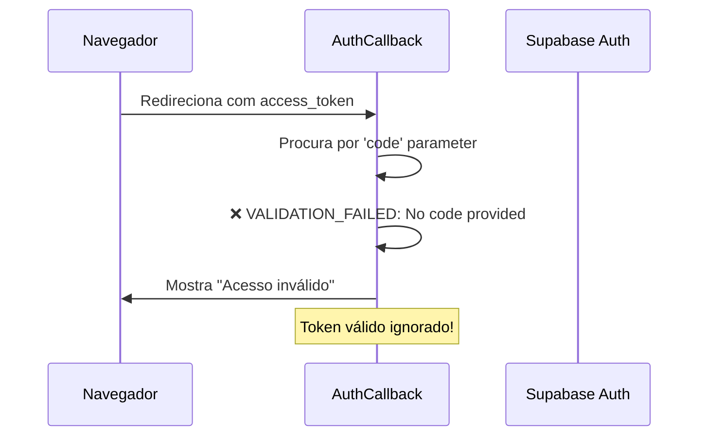
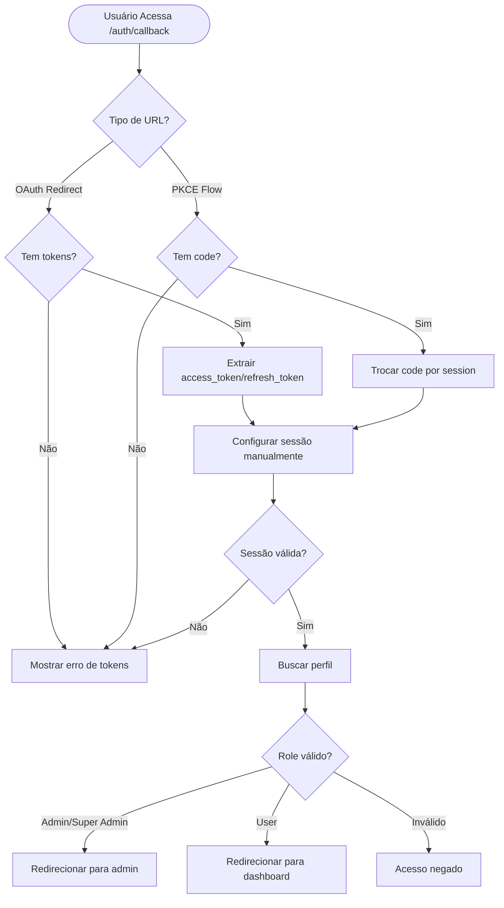
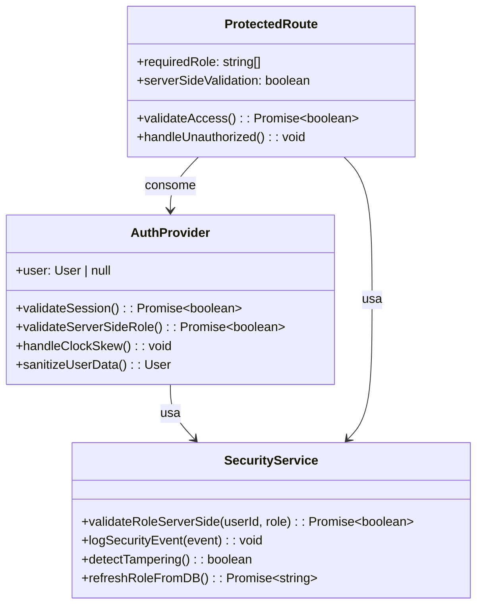
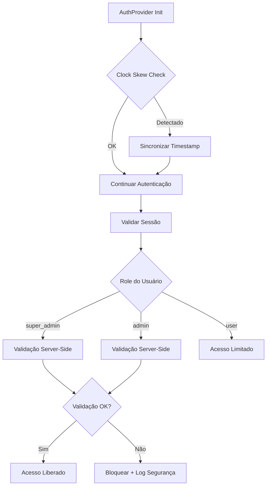
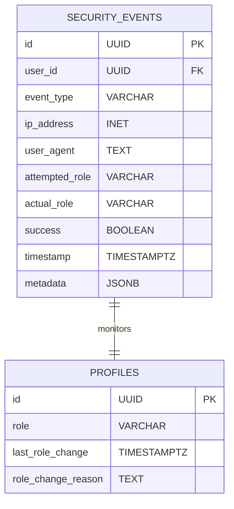
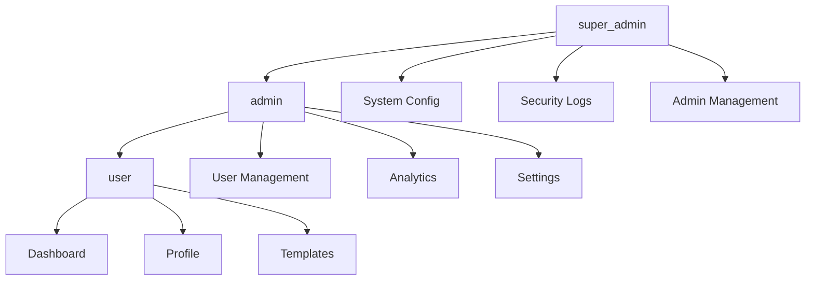
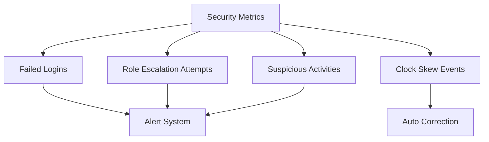

# Design: Correção de Validação de Autenticação e Segurança

## Visão Geral

Este design documenta a análise e correção dos problemas de validação de autenticação identificados nos logs do console, incluindo mensagens de "acesso inválido", warnings do Supabase sobre timestamps futuros, e fortalecimento da segurança baseada em roles para acesso administrativo.

## Problemas Identificados

### 1. Validação Incorreta no AuthCallback

**Problema**: O componente `AuthCallback` está validando incorretamente parâmetros de URL para tokens OAuth.



**Logs Observados**:
- `CALLBACK_START {url: 'http://localhost:8080/auth/callback#access_token=...&refresh_token=...&token_type=bearer'}`
- `VALIDATION_FAILED {reason: 'No code provided'}`
- `MISSING_CODE {hasParams: false}`

### 2. Warning de Clock Skew do Supabase

**Problema**: Divergência entre relógio do servidor e cliente causando warning de segurança.

```
@supabase/gotrue-js: Session as retrieved from URL was issued in the future? Check the device clock for skew 1755906877 1755910477 1755906838
```

### 3. Erro HTTP 400 na Consulta de Profiles

**Problema**: Consultas malformadas na tabela `profiles` retornando erro 400.

```
HEAD https://qgtgvqfikqfjbeixzbyb.supabase.co/rest/v1/profiles?select=count%28*%29 400 (Bad Request)
```

### 4. Vulnerabilidades de Segurança

**Problemas**:
- Validação de role apenas no frontend
- Possibilidade de manipulação via DevTools
- Falta de validação server-side robusta

## Arquitetura da Solução

### Fluxo de Autenticação Corrigido



### Sistema de Segurança Aprimorado



## Componentes a Serem Modificados

### 1. AuthCallback - Correção da Validação

**Mudanças Necessárias**:

| Problema                  | Solução Atual                 | Solução Proposta                      |
| ------------------------- | ----------------------------- | ------------------------------------- |
| Procura apenas por `code` | Falha em OAuth redirect       | Detectar tipo de flow (PKCE vs OAuth) |
| Ignora `access_token`     | Usuário ve erro desnecessário | Processar tokens diretamente          |
| Timeout inadequado        | 10s pode ser insuficiente     | Timeout adaptativo                    |

**Lógica de Detecção**:
```typescript
const detectAuthFlow = (searchParams: URLSearchParams): 'oauth' | 'pkce' | 'error' => {
  if (searchParams.get('error')) return 'error';
  if (window.location.hash.includes('access_token')) return 'oauth';
  if (searchParams.get('code')) return 'pkce';
  return 'error';
}
```

### 2. AuthProvider - Melhorias de Segurança

**Funcionalidades Adicionais**:



### 3. Correção de Consultas Malformadas

**Problema**: Query `count(*)` malformada

```typescript
// ❌ Problemático
supabase.from('profiles').select('count(*)', { count: 'exact', head: true })

// ✅ Correto
supabase.from('profiles').select('*', { count: 'exact', head: true })
```

## Implementação de Segurança

### 1. Validação Server-Side de Roles

```typescript
interface SecurityValidation {
  validateRoleServerSide(userId: string, expectedRole: string): Promise<boolean>
  logSecurityEvent(event: SecurityEvent): void
  detectRoleManipulation(): boolean
}
```

### 2. Proteção Contra Manipulação Frontend

**Estratégias**:

| Vulnerabilidade                    | Proteção                        |
| ---------------------------------- | ------------------------------- |
| Edição de `user.role` via DevTools | Hash/checksum do role           |
| Modificação de localStorage        | Validação periódica server-side |
| Interceptação de requests          | Tokens JWT com role embarcado   |
| Replay attacks                     | Timestamp validation            |

### 3. Auditoria e Logs de Segurança



## Testes de Segurança

### 1. Cenários de Teste

| Cenário                     | Expectativa            | Validação         |
| --------------------------- | ---------------------- | ----------------- |
| Admin acessa rota user      | ✅ Permitido            | hasAdminAccess()  |
| User acessa rota admin      | ❌ Negado + redirect    | !hasAdminAccess() |
| Role manipulado no frontend | ❌ Detectado + bloqueio | Server validation |
| Token expirado              | ❌ Renovação automática | Session refresh   |
| Clock skew presente         | ⚠️ Warning + correção   | Timestamp sync    |

### 2. Matriz de Permissões



## Correções de Clock Skew

### 1. Detecção e Correção

```typescript
class ClockSkewHandler {
  private skewOffset: number = 0;
  
  detectSkew(serverTime: number, clientTime: number): number {
    return serverTime - clientTime;
  }
  
  adjustTimestamp(timestamp: number): number {
    return timestamp + this.skewOffset;
  }
  
  syncWithServer(): Promise<void> {
    // Implementar sincronização NTP-like
  }
}
```

### 2. Configuração Supabase

```typescript
const supabaseConfig = {
  auth: {
    autoRefreshToken: true,
    persistSession: true,
    detectSessionInUrl: true,
    flowType: 'pkce', // Usar PKCE por padrão
    timeSkewTolerance: 10 // segundos
  }
}
```

## Monitoramento e Alertas

### 1. Métricas de Segurança



### 2. Dashboard de Segurança

| Métrica       | Threshold | Ação          |
| ------------- | --------- | ------------- |
| Failed logins | > 5/min   | Rate limiting |
| Role changes  | > 1/day   | Manual review |
| Clock skew    | > 30s     | Auto sync     |
| Admin access  | Sempre    | Log + notify  |

## Validação Final

### 1. Checklist de Correções

- [ ] AuthCallback processa OAuth redirects corretamente
- [ ] Clock skew é detectado e corrigido automaticamente  
- [ ] Consultas malformadas são corrigidas
- [ ] Validação server-side de roles implementada
- [ ] Logs de segurança são registrados
- [ ] Proteção contra manipulação frontend ativa
- [ ] Testes de penetração passando
- [ ] Documentação de segurança atualizada

### 2. Critérios de Aceitação

**Performance**:
- Login completo em < 2s
- Validação de role em < 500ms
- Zero errors no console após login

**Segurança**:
- Impossibilidade de escalação de privilégio via frontend
- Detecção de manipulação em < 1s
- Logs de auditoria completos

**Experiência**:
- Eliminação da tela de "acesso inválido"
- Feedback claro sobre status de autenticação
- Transições suaves entre estados