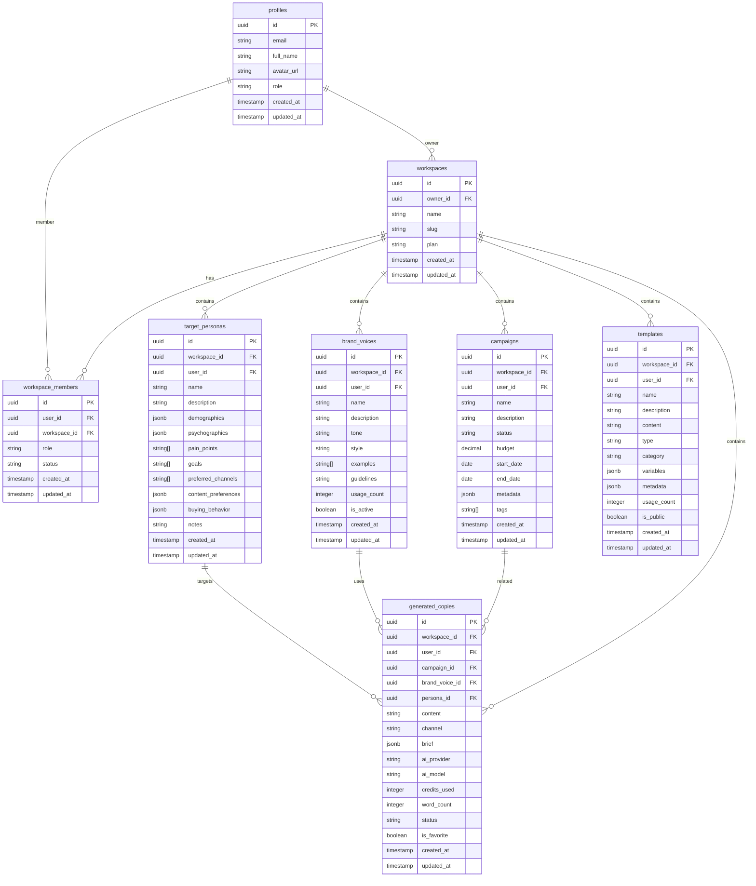

# Auditoria de Integração do Banco de Dados - StorySpark

## Visão Geral

Este documento analisa o estado atual da integração entre o frontend React e o banco de dados Supabase, identificando onde ainda existem dados mockados e definindo um plano para migrar completamente para dados reais.

## Estrutura do Banco de Dados

### Tabelas Principais (Confirmadas)



## Estado da Integração por Módulo

### ✅ Módulos Totalmente Integrados

#### 1. Sistema de Autenticação
- **Estado**: ✅ FUNCIONANDO
- **Tabelas**: `profiles`, `workspaces`, `workspace_members`
- **Funcionalidades**: Login, registro, roles, workspace management
- **Observações**: Sistema completo com RLS e triggers automáticos

#### 2. Brand Voices
- **Estado**: ✅ FUNCIONANDO
- **Tabela**: `brand_voices`
- **Service**: `brandVoicesService.ts`
- **Página**: `BrandVoices.tsx`
- **Mock Restante**: Apenas métricas de engajamento (`avgEngagement`, `campaigns`)
- **Observações**: CRUD completo implementado

#### 3. Campanhas
- **Estado**: ✅ FUNCIONANDO
- **Tabela**: `campaigns`
- **Service**: `campaignsService.ts`
- **Página**: `Campaigns.tsx`
- **Mock Restante**: Métricas de performance (`impressions`, `clicks`, `ctr`)
- **Observações**: CRUD completo implementado

### 🟡 Módulos Parcialmente Integrados

#### 4. Personas
- **Estado**: 🟡 PARCIALMENTE INTEGRADO
- **Tabela**: `target_personas`
- **Service**: Implementado diretamente na página
- **Página**: `Personas.tsx`
- **Issues**: 
  - Falta service dedicado
  - Dados de seed não foram aplicados
  - Interface não processa todos os campos JSONB
- **Ação**: Aplicar seeds + melhorar interface

#### 5. Templates
- **Estado**: 🟡 PARCIALMENTE INTEGRADO
- **Tabela**: `templates`
- **Service**: `templatesService.ts`
- **Página**: `Templates.tsx`
- **Issues**:
  - Integração completa mas sem dados de seed
  - Métricas mockadas para performance
- **Ação**: Aplicar seeds + implementar métricas reais

#### 6. Analytics
- **Estado**: 🟡 DADOS REAIS + MOCKS
- **Service**: `analyticsService.ts`
- **Página**: `Analytics.tsx`
- **Issues**:
  - Puxa dados reais das tabelas principais
  - Usa mocks para: engagement, conversion rates, usage trends
- **Ação**: Implementar tabela de métricas e events

### ❌ Módulos Ainda com Mocks

#### 7. Dashboard
- **Estado**: ❌ MAJORITARIAMENTE MOCK
- **Página**: `Dashboard.tsx`
- **Issues**: 
  - Estatísticas gerais mockadas
  - Gráficos com dados temporários
  - Atividades recentes mockadas
- **Ação**: Integrar com todas as tabelas + criar eventos de auditoria

#### 8. Voices IA
- **Estado**: ❌ MOCK COMPLETO  
- **Página**: `Voices.tsx`
- **Issues**: Funcionalidade completamente mockada
- **Ação**: Definir estrutura de dados + implementar

#### 9. Content Library
- **Estado**: ❌ MOCK COMPLETO
- **Página**: `ContentLibrary.tsx`
- **Issues**: Sistema de biblioteca não implementado
- **Ação**: Implementar estrutura de arquivos/assets

## Dados de Seed Disponíveis

### Seeds Existentes
1. **`seed_brand_voices.sql`** - 5 brand voices de exemplo
2. **`seed_personas.sql`** - 4 personas detalhadas
3. **`seed_campaigns.sql`** - 5 campanhas completas

### Seeds Necessários
1. **Templates** - Biblioteca inicial de templates
2. **Analytics Events** - Dados históricos de métricas
3. **Generated Copies** - Exemplos de conteúdo gerado
4. **User Activities** - Logs de atividades para auditoria

## Plano de Implementação

### Fase 1: Aplicação de Seeds Existentes
1. Executar seeds de brand voices, personas e campanhas
2. Verificar se dados aparecem corretamente nas interfaces
3. Ajustar interfaces para processar campos JSONB complexos

### Fase 2: Criação de Seeds Faltantes
1. Criar seed de templates por categoria
2. Implementar sistema de eventos/métricas
3. Gerar dados históricos para analytics

### Fase 3: Remoção de Mocks
1. Substituir métricas mockadas por queries reais
2. Implementar cálculos de engagement e performance
3. Criar sistema de tracking de uso

### Fase 4: Otimização
1. Implementar cache para queries pesadas
2. Adicionar índices necessários
3. Otimizar consultas complexas

## Métricas Mock vs Real

### Brand Voices
- **Mock**: `avgEngagement`, `campaigns` (random)
- **Real**: `usage_count` (banco)
- **Solução**: Criar tabela de métricas ou calcular via queries

### Campanhas  
- **Mock**: `impressions`, `clicks`, `ctr`, `conversions`
- **Real**: `budget`, `status`, `dates`
- **Solução**: Implementar sistema de tracking de métricas

### Analytics
- **Mock**: Taxa de engajamento, conversão, trends temporais
- **Real**: Contadores básicos de entidades
- **Solução**: Sistema de eventos + agregações

## Requisitos Técnicos

### Tabelas Adicionais Necessárias
```sql
-- Sistema de métricas
CREATE TABLE campaign_metrics (
  id UUID PRIMARY KEY DEFAULT gen_random_uuid(),
  campaign_id UUID REFERENCES campaigns(id),
  date DATE NOT NULL,
  impressions INTEGER DEFAULT 0,
  clicks INTEGER DEFAULT 0,
  conversions INTEGER DEFAULT 0,
  cost DECIMAL(10,2) DEFAULT 0,
  created_at TIMESTAMP DEFAULT NOW()
);

-- Sistema de eventos de auditoria
CREATE TABLE user_activities (
  id UUID PRIMARY KEY DEFAULT gen_random_uuid(),
  user_id UUID REFERENCES profiles(id),
  workspace_id UUID REFERENCES workspaces(id),
  action VARCHAR(100) NOT NULL,
  entity_type VARCHAR(50),
  entity_id UUID,
  metadata JSONB,
  created_at TIMESTAMP DEFAULT NOW()
);

-- Sistema de arquivos/assets
CREATE TABLE assets (
  id UUID PRIMARY KEY DEFAULT gen_random_uuid(),
  workspace_id UUID REFERENCES workspaces(id),
  user_id UUID REFERENCES profiles(id),
  name VARCHAR(255) NOT NULL,
  file_type VARCHAR(50),
  file_size INTEGER,
  storage_path TEXT,
  metadata JSONB,
  is_public BOOLEAN DEFAULT FALSE,
  created_at TIMESTAMP DEFAULT NOW()
);
```

### Índices Recomendados
```sql
-- Performance para queries frequentes
CREATE INDEX idx_campaigns_workspace_status ON campaigns(workspace_id, status);
CREATE INDEX idx_brand_voices_workspace_active ON brand_voices(workspace_id, is_active);
CREATE INDEX idx_templates_workspace_type ON templates(workspace_id, type);
CREATE INDEX idx_personas_workspace ON target_personas(workspace_id);
CREATE INDEX idx_activities_user_date ON user_activities(user_id, created_at DESC);
CREATE INDEX idx_metrics_campaign_date ON campaign_metrics(campaign_id, date DESC);
```

## Conclusão

O sistema StorySpark possui uma base sólida com as principais tabelas implementadas e funcionando. O foco deve ser:

1. **Imediato**: Aplicar seeds existentes na conta super admin
2. **Curto prazo**: Remover mocks das métricas básicas
3. **Médio prazo**: Implementar sistema completo de tracking
4. **Longo prazo**: Otimização e cache de performance

A maioria dos módulos já possui integração funcional, necessitando apenas de dados reais e ajustes nas métricas calculadas.- **Real**: `budget`, `status`, `dates`
- **Solução**: Implementar sistema de tracking de métricas

### Analytics
- **Mock**: Taxa de engajamento, conversão, trends temporais
- **Real**: Contadores básicos de entidades
- **Solução**: Sistema de eventos + agregações

## Requisitos Técnicos

### Tabelas Adicionais Necessárias
```sql
-- Sistema de métricas
CREATE TABLE campaign_metrics (
  id UUID PRIMARY KEY DEFAULT gen_random_uuid(),
  campaign_id UUID REFERENCES campaigns(id),
  date DATE NOT NULL,
  impressions INTEGER DEFAULT 0,
  clicks INTEGER DEFAULT 0,
  conversions INTEGER DEFAULT 0,
  cost DECIMAL(10,2) DEFAULT 0,
  created_at TIMESTAMP DEFAULT NOW()
);

-- Sistema de eventos de auditoria
CREATE TABLE user_activities (
  id UUID PRIMARY KEY DEFAULT gen_random_uuid(),
  user_id UUID REFERENCES profiles(id),
  workspace_id UUID REFERENCES workspaces(id),
  action VARCHAR(100) NOT NULL,
  entity_type VARCHAR(50),
  entity_id UUID,
  metadata JSONB,
  created_at TIMESTAMP DEFAULT NOW()
);

-- Sistema de arquivos/assets
CREATE TABLE assets (
  id UUID PRIMARY KEY DEFAULT gen_random_uuid(),
  workspace_id UUID REFERENCES workspaces(id),
  user_id UUID REFERENCES profiles(id),
  name VARCHAR(255) NOT NULL,
  file_type VARCHAR(50),
  file_size INTEGER,
  storage_path TEXT,
  metadata JSONB,
  is_public BOOLEAN DEFAULT FALSE,
  created_at TIMESTAMP DEFAULT NOW()
);
```

### Índices Recomendados
```sql
-- Performance para queries frequentes
CREATE INDEX idx_campaigns_workspace_status ON campaigns(workspace_id, status);
CREATE INDEX idx_brand_voices_workspace_active ON brand_voices(workspace_id, is_active);
CREATE INDEX idx_templates_workspace_type ON templates(workspace_id, type);
CREATE INDEX idx_personas_workspace ON target_personas(workspace_id);
CREATE INDEX idx_activities_user_date ON user_activities(user_id, created_at DESC);
CREATE INDEX idx_metrics_campaign_date ON campaign_metrics(campaign_id, date DESC);
```

## Conclusão

O sistema StorySpark possui uma base sólida com as principais tabelas implementadas e funcionando. O foco deve ser:

1. **Imediato**: Aplicar seeds existentes na conta super admin
2. **Curto prazo**: Remover mocks das métricas básicas
3. **Médio prazo**: Implementar sistema completo de tracking
4. **Longo prazo**: Otimização e cache de performance

A maioria dos módulos já possui integração funcional, necessitando apenas de dados reais e ajustes nas métricas calculadas.


