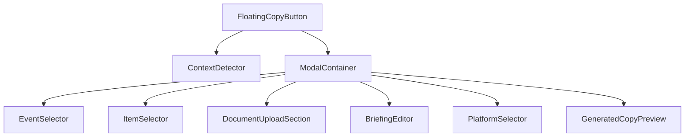

# Correção de Erros no Componente FloatingCopyButton

## 1. Visão Geral

O componente `FloatingCopyButton` é um elemento central da plataforma StorySpark que permite aos usuários gerar copies de marketing contextualizadas usando inteligência artificial. Após análise do código, foram identificados alguns problemas que afetam a funcionalidade e usabilidade do componente.

## 2. Problemas Identificados

### 2.1 Problemas de Performance
- O componente tem mais de 1800 linhas, o que dificulta a manutenção
- Muitos estados e efeitos colaterais interdependentes
- Lógica complexa de renderização condicional

### 2.2 Problemas de Tipagem
- Uso excessivo de `any` e `as any` para acessar propriedades
- Interfaces incompletas para os dados contextuais
- Falta de validação em alguns pontos críticos

### 2.3 Problemas de Usabilidade
- Fluxo de personalização confuso em alguns contextos
- Falta de feedback claro durante o processo de geração
- Tratamento inadequado de erros em alguns cenários

### 2.4 Problemas de Integração
- Dependência direta de múltiplos serviços e hooks
- Acoplamento forte com a estrutura de rotas
- Falta de tratamento adequado para casos limítrofes

## 3. Arquitetura Proposta

### 3.1 Refatoração em Componentes Menores



### 3.2 Separação de Responsabilidades

1. **FloatingCopyButton** - Componente principal que gerencia o estado global
2. **ContextDetector** - Detecta o contexto com base na rota atual e fornece configurações específicas, incluindo ícones, cores, sugestões e valores padrão para plataforma e tipo de conteúdo
3. **ModalContainer** - Gerencia a exibição do modal e seus estados
4. **EventSelector** - Permite selecionar eventos do calendário
5. **ItemSelector** - Permite selecionar itens contextuais (personas, brand voices, etc.)
6. **DocumentUploadSection** - Gerencia o upload e processamento de documentos
7. **BriefingEditor** - Editor avançado de briefing com sugestões, autocomplete baseado em histórico e validação de conteúdo
8. **PlatformSelector** - Seleção de plataforma e tipo de conteúdo
9. **GeneratedCopyPreview** - Preview e ações da copy gerada

## 4. Correções Específicas

### 4.1 Tipagem Aprimorada

```typescript
// Antes: Uso de any para acessar propriedades
case '/ai-ideas':
  baseContext = `Desenvolver copy baseada na ideia: ${(item as any).topic || (item as any).content?.[0] || 'Ideia IA'}`;

// Depois: Interface específica para cada tipo de item
interface AIdea {
  id: string;
  topic: string;
  content: string[];
  createdAt: string;
}

// Uso correto com tipagem
case '/ai-ideas':
  baseContext = `Desenvolver copy baseada na ideia: ${(item as AIdea).topic || (item as AIdea).content?.[0] || 'Ideia IA'}`;
```

### 4.2 Tratamento de Erros

```typescript
// Antes: Tratamento genérico de erros
catch (error) {
  toastNotifications.showError(
    "Erro na geração",
    "Tente novamente em alguns instantes."
  );
}

// Depois: Tratamento específico com detalhes
catch (error) {
  const errorMessage = error instanceof Error ? error.message : "Erro desconhecido";
  const errorDetails = error instanceof Error && error.cause ? error.cause.toString() : "";
  
  // Tratamento específico para diferentes tipos de erro
  if (errorMessage.includes("token")) {
    toastNotifications.showError(
      "Limite de tokens excedido",
      "O briefing é muito longo. Por favor, reduza o tamanho e tente novamente."
    );
  } else if (errorMessage.includes("rate")) {
    toastNotifications.showError(
      "Limite de requisições atingido",
      "Aguarde alguns minutos e tente novamente."
    );
  } else {
    toastNotifications.showError(
      "Erro na geração",
      `Não foi possível gerar a copy. ${errorMessage}${errorDetails ? ` Detalhes: ${errorDetails}` : ""}`
    );
  }
  
  // Log para debugging
  console.error("Erro na geração de copy:", {
    error,
    briefing: currentBriefing,
    platform,
    copyType
  });
}
```

### 4.3 Otimização de Performance

```typescript
// Antes: Re-renderizações desnecessárias
useEffect(() => {
  // Lógica complexa executada a cada mudança
}, [location.pathname, currentContext, events, voices, personas]);

// Depois: Memoização e dependências otimizadas
const pageSpecificData = useMemo(() => getPageSpecificData(), [location.pathname]);
const hasEvents = useMemo(() => events.length > 0, [events]);

useEffect(() => {
  if (currentContext.defaultPlatform) setPlatform(currentContext.defaultPlatform);
  if (currentContext.defaultType) setCopyType(currentContext.defaultType);
  
  // Lógica específica para calendário
  if (location.pathname === '/calendar' && hasEvents) {
    setShowEventSelector(true);
  }
  
  // Lógica para páginas com dados contextuais
  if (pageSpecificData) {
    setShowItemSelector(true);
  }
}, [location.pathname, currentContext, hasEvents, pageSpecificData]);
```

## 5. Melhorias de Usabilidade

### 5.1 Fluxo de Personalização Simplificado

```typescript
// Antes: Fluxo confuso com múltiplos estados
const handleItemSelect = (item: BrandVoice | Persona | Template | Campaign) => {
  setSelectedItem(item);
  
  // Usar contexto específico da página se disponível
  let baseContext = '';
  if (pageData?.getContext) {
    baseContext = pageData.getContext(item);
  } else {
    // Fallback para configuração genérica
    switch (location.pathname) {
      // Múltiplos casos...
    }
  }
  
  // Definir briefing base e entrar em modo de personalização
  setBriefing(baseContext);
  setCustomBriefing(baseContext);
  setCustomizationMode(true);
  setShowItemSelector(false);
};

// Depois: Fluxo claro e direto
const handleItemSelect = (item: BrandVoice | Persona | Template | Campaign) => {
  setSelectedItem(item);
  
  // Obter contexto diretamente do item selecionado
  const context = getItemContext(item);
  
  // Atualizar briefing com contexto
  setBriefing(context);
  setShowItemSelector(false);
  
  // Mostrar editor de briefing para personalização
  setShowBriefingEditor(true);
};
```

### 5.2 Validação de Conteúdo

```typescript
// Adicionar validação de briefing antes da geração
const validateBriefing = (briefing: string): { isValid: boolean; errors: string[] } => {
  const errors: string[] = [];
  
  if (!briefing.trim()) {
    errors.push("O briefing é obrigatório");
  }
  
  if (briefing.length < 10) {
    errors.push("O briefing deve ter pelo menos 10 caracteres");
  }
  
  if (briefing.length > 500) {
    errors.push("O briefing não pode exceder 500 caracteres");
  }
  
  return {
    isValid: errors.length === 0,
    errors
  };
};

// Uso na função de geração
const handleGenerate = async () => {
  const currentBriefing = customizationMode ? customBriefing : briefing;
  
  const validation = validateBriefing(currentBriefing);
  if (!validation.isValid) {
    toastNotifications.showError(
      "Briefing inválido",
      validation.errors.join(", ")
    );
    return;
  }
  
  // Continuar com a geração...
};
```

### 5.2 Feedback Visual Aprimorado

```typescript
// Adicionar estados de loading mais específicos
const [isGeneratingCopy, setIsGeneratingCopy] = useState(false);
const [isCopyingToClipboard, setIsCopyingToClipboard] = useState(false);
const [isApplyingToItem, setIsApplyingToItem] = useState(false);

// Atualizar UI com base nos estados
<Button 
  onClick={handleCopyToClipboard} 
  disabled={isCopyingToClipboard}
  className="flex-1 bg-gradient-to-r from-blue-600 to-blue-700 hover:from-blue-700 hover:to-blue-800 text-white shadow-lg hover:shadow-xl transition-all duration-200"
  size="lg"
>
  {isCopyingToClipboard ? (
    <>
      <Loader2 className="w-4 h-4 mr-2 animate-spin" />
      Copiando...
    </>
  ) : (
    <>
      <CopyIcon className="w-4 h-4 mr-2" />
      Copiar Copy
    </>
  )}
</Button>
```

## 6. Integração com Serviços

### 6.1 Serviço de Geração de Copy

```typescript
// Antes: Chamada direta ao serviço
const response = await copyGenerationService.generateCopy({
  briefing: currentBriefing,
  platform: platform || 'Instagram',
  copyType: copyType || 'Post Orgânico',
  tone: 'Profissional',
  userId: user?.id
});

// Depois: Wrapper com tratamento de erros e retry
const generateCopyWithRetry = async (request: CopyGenerationRequest, retries = 3): Promise<CopyGenerationResponse> => {
  try {
    return await copyGenerationService.generateCopy(request);
  } catch (error) {
    if (retries > 0) {
      // Aguardar antes de tentar novamente
      await new Promise(resolve => setTimeout(resolve, 1000 * (4 - retries)));
      return generateCopyWithRetry(request, retries - 1);
    }
    throw error;
  }
};

const response = await generateCopyWithRetry({
  briefing: currentBriefing,
  platform: platform || 'Instagram',
  copyType: copyType || 'Post Orgânico',
  tone: 'Profissional',
  userId: user?.id
});
```

### 6.2 Serviço de Upload de Documentos

```typescript
// Antes: Integração direta com callback
<DocumentUploadModal
  isOpen={showUploadModal}
  onClose={() => setShowUploadModal(false)}
  onDataExtracted={handleDataExtracted}
/>

// Depois: Hook personalizado para gerenciar o upload
const { 
  isOpen: isUploadModalOpen, 
  open: openUploadModal, 
  close: closeUploadModal,
  extractedData,
  isAnalyzing,
  applyExtractedData
} = useDocumentUpload({
  onExtracted: handleDataExtracted
});

// Uso simplificado
<Button onClick={openUploadModal}>
  Upload com IA
</Button>

<DocumentUploadModal
  isOpen={isUploadModalOpen}
  onClose={closeUploadModal}
  extractedData={extractedData}
  isAnalyzing={isAnalyzing}
  onApply={applyExtractedData}
/>
```

## 7. Testes

### 7.1 Testes Unitários

```typescript
// Testes para o ContextDetector
describe('ContextDetector', () => {
  it('deve detectar o contexto correto para /personas', () => {
    const context = detectContext('/personas');
    expect(context.title).toBe('Copy para Personas');
    expect(context.icon).toBe(Users);
  });
  
  it('deve usar o contexto padrão para rotas desconhecidas', () => {
    const context = detectContext('/unknown-route');
    expect(context.title).toBe('Criar Copy com IA');
    expect(context.icon).toBe(Wand2);
  });
});

// Testes para o gerenciamento de estado
describe('FloatingCopyButton State Management', () => {
  it('deve resetar o modal corretamente', () => {
    const { result } = renderHook(() => useFloatingCopyButton());
    
    act(() => {
      result.current.setBriefing('Test briefing');
      result.current.setGeneratedCopy('Test copy');
      result.current.resetModal();
    });
    
    expect(result.current.briefing).toBe('');
    expect(result.current.generatedCopy).toBe('');
  });
});
```

### 7.2 Testes de Integração

```typescript
// Testes para a integração com copyGenerationService
describe('Copy Generation Integration', () => {
  it('deve chamar o serviço com os parâmetros corretos', async () => {
    const mockGenerateCopy = jest.spyOn(copyGenerationService, 'generateCopy')
      .mockResolvedValue({
        content: 'Generated copy',
        provider: 'openai',
        model: 'gpt-4',
        tokensUsed: 100,
        success: true
      });
    
    const { result } = renderHook(() => useFloatingCopyButton());
    
    await act(async () => {
      await result.current.generateCopy({
        briefing: 'Test briefing',
        platform: 'Instagram',
        copyType: 'Post Orgânico'
      });
    });
    
    expect(mockGenerateCopy).toHaveBeenCalledWith({
      briefing: 'Test briefing',
      platform: 'Instagram',
      copyType: 'Post Orgânico',
      tone: 'Profissional',
      userId: undefined
    });
  });
});
```

### 7.3 Testes de Usabilidade

```typescript
// Testes para verificar a experiência do usuário
it('deve mostrar feedback visual durante a geração de copy', async () => {
  const mockGenerateCopy = jest.spyOn(copyGenerationService, 'generateCopy')
    .mockImplementation(() => new Promise(resolve => 
      setTimeout(() => resolve({
        content: 'Generated copy',
        provider: 'openai',
        model: 'gpt-4',
        tokensUsed: 100,
        success: true
      }), 100)
    ));
  
  render(<FloatingCopyButton />);
  
  // Simular clique no botão de geração
  fireEvent.click(screen.getByText('Gerar Copy'));
  
  // Verificar se o estado de loading é exibido
  expect(screen.getByText('Gerando Copy com IA...')).toBeInTheDocument();
  
  // Aguardar a conclusão e verificar o resultado
  await waitFor(() => 
    expect(screen.getByText('Copy gerada com sucesso!')).toBeInTheDocument()
  );
});
```

## 8. Considerações Finais

A refatoração proposta para o componente `FloatingCopyButton` visa:

1. **Melhorar a manutenibilidade** através da separação de responsabilidades
2. **Aumentar a robustez** com tipagem adequada e tratamento de erros
3. **Otimizar a performance** com memoização e redução de re-renderizações
4. **Melhorar a experiência do usuário** com feedback claro e fluxos simplificados
5. **Facilitar testes** com componentes menores e bem definidos

Essas mudanças tornarão o componente mais confiável, performático e fácil de evoluir conforme as necessidades da plataforma StorySpark.

## 9. Implementação de Error Boundaries

Para evitar que erros no componente afetem toda a aplicação, deve-se implementar Error Boundaries:

```typescript
class FloatingCopyButtonErrorBoundary extends React.Component<{}, { hasError: boolean }> {
  constructor(props: {}) {
    super(props);
    this.state = { hasError: false };
  }

  static getDerivedStateFromError(error: Error) {
    return { hasError: true };
  }

  componentDidCatch(error: Error, errorInfo: React.ErrorInfo) {
    console.error('Erro no FloatingCopyButton:', error, errorInfo);
    // Enviar erro para serviço de monitoramento
  }

  render() {
    if (this.state.hasError) {
      return <div className="error-fallback">Algo deu errado. Por favor, recarregue a página.</div>;
    }

    return this.props.children;
  }
}

// Uso no App
<FloatingCopyButtonErrorBoundary>
  <FloatingCopyButton />
</FloatingCopyButtonErrorBoundary>
```

## 10. Monitoramento de Desempenho

Para garantir que as otimizações tenham o efeito desejado, deve-se implementar monitoramento de performance:

```typescript
// Medir tempo de renderização
type PerformanceMetrics = {
  renderTime: number;
  generationTime: number;
  copyLength: number;
};

const measurePerformance = (callback: () => void, metric: keyof PerformanceMetrics) => {
  const start = performance.now();
  callback();
  const end = performance.now();
  
  // Enviar métrica para serviço de analytics
  analyticsService.track('floating_copy_button_performance', {
    [metric]: end - start
  });
};

// Uso na geração de copy
const handleGenerate = async () => {
  measurePerformance(async () => {
    // Lógica de geração de copy
    const response = await copyGenerationService.generateCopy(request);
    
    // Medir tamanho da copy gerada
    analyticsService.track('generated_copy_length', {
      length: response.content.length
    });
  }, 'generationTime');
};
```

## 11. Conclusão

A refatoração do componente `FloatingCopyButton` proposta neste documento aborda os principais problemas identificados no código atual, incluindo questões de performance, tipagem, usabilidade e manutenibilidade. A abordagem modular proposta não apenas corrige os problemas existentes, mas também estabelece uma base sólida para futuras melhorias e expansões do componente.

A implementação das melhorias sugeridas resultará em uma experiência mais robusta e eficiente para os usuários da plataforma StorySpark, ao mesmo tempo que facilitará a manutenção e evolução do código pelos desenvolvedores.