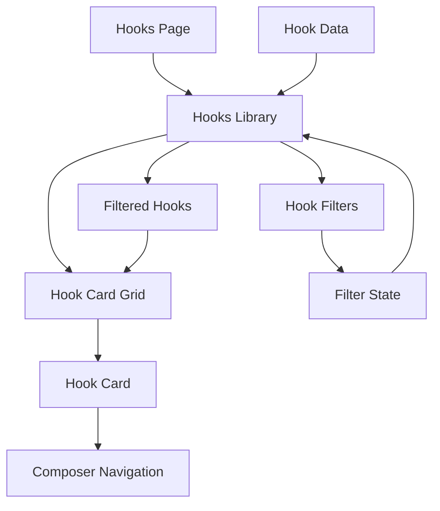

# Migração do Sistema de Hooks

## 1. Visão Geral

Este documento descreve o processo de migração do sistema de hooks da pasta `spark-copy-fast-67` para o projeto principal StorySpark. A migração envolve a atualização dos componentes, dados e páginas relacionados aos hooks para incorporar as melhorias e funcionalidades adicionais presentes na versão mais recente.

## 2. Arquitetura Atual

### 2.1 Estrutura de Componentes
- `Hooks.tsx` (página principal)
- `HooksLibrary.tsx` (biblioteca de hooks)
- `HookCard.tsx` (componente de card individual)
- `HookFilters.tsx` (componente de filtros)
- `hooks.ts` (dados e utilitários)

### 2.2 Estado Atual
- O projeto principal já possui uma implementação básica de hooks
- A versão em `spark-copy-fast-67` contém melhorias significativas
- Necessário substituir os componentes atuais pelos atualizados

## 3. Componentes a Serem Migrados

### 3.1 Hooks Page (`src/pages/Hooks.tsx`)
- **Origem**: `spark-copy-fast-67/src/pages/Hooks.tsx`
- **Destino**: `src/pages/Hooks.tsx`
- **Melhorias**:
  - Adição de tracking analytics via gtag
  - Melhorias na gestão de título da página

### 3.2 Hooks Library (`src/components/HooksLibrary.tsx`)
- **Origem**: `spark-copy-fast-67/src/components/HooksLibrary.tsx`
- **Destino**: `src/components/HooksLibrary.tsx`
- **Melhorias**:
  - Adição de tracking analytics
  - Transições e animações aprimoradas
  - Melhorias na navegação para o composer
  - Feedback visual aprimorado

### 3.3 Hook Card (`src/components/HookCard.tsx`)
- **Origem**: `spark-copy-fast-67/src/components/HookCard.tsx`
- **Destino**: `src/components/HookCard.tsx`
- **Melhorias**:
  - Adição de tracking analytics quando um hook é selecionado
  - Toast notifications aprimoradas com sonner
  - Efeitos visuais e transições melhorados
  - Navegação aprimorada para o composer

### 3.4 Hook Filters (`src/components/HookFilters.tsx`)
- **Origem**: `spark-copy-fast-67/src/components/HookFilters.tsx`
- **Destino**: `src/components/HookFilters.tsx`
- **Melhorias**:
  - Interface mais intuitiva
  - Feedback visual aprimorado
  - Animações e transições melhoradas

### 3.5 Hook Data (`src/data/hooks.ts`)
- **Origem**: `spark-copy-fast-67/src/data/hooks.ts`
- **Destino**: `src/data/hooks.ts`
- **Melhorias**:
  - Expansão significativa do conjunto de dados (de ~50 para ~300 hooks)
  - Adição de mais categorias e tags
  - Funções utilitárias aprimoradas

## 4. Diagrama de Fluxo de Dados

## 5. Plano de Migração

### 5.1 Etapas
1. Backup dos arquivos atuais
2. Substituição dos componentes:
   - `HooksLibrary.tsx`
   - `HookCard.tsx`
   - `HookFilters.tsx`
3. Atualização do arquivo de dados `hooks.ts`
4. Atualização da página `Hooks.tsx`
5. Testes de funcionalidade
6. Ajustes finos

### 5.2 Dependências
- `lucide-react` (já presente no projeto)
- `sonner` (verificar se está instalado)
- `react-router-dom` (já presente no projeto)

### 5.3 Impactos
- Melhoria na experiência do usuário
- Aumento significativo na base de hooks disponíveis
- Adição de tracking analytics
- Melhorias de performance e feedback visual

## 6. Testes Necessários

### 6.1 Funcionalidades
- [ ] Navegação para a página de hooks
- [ ] Filtragem por categorias
- [ ] Busca por palavras-chave
- [ ] Seleção de hooks e navegação para o composer
- [ ] Funcionalidade de favoritos
- [ ] Tracking analytics

### 6.2 Compatibilidade
- [ ] Responsividade em dispositivos móveis
- [ ] Compatibilidade com navegadores
- [ ] Integração com o sistema de notificações existente

## 7. Considerações Técnicas

### 7.1 Diferenças de Implementação
- O projeto principal usa `useToast` enquanto a nova versão usa `sonner`
- As rotas de navegação podem precisar de ajustes (`/app` vs `/composer`)

### 7.2 Ajustes Necessários
- Verificar e possivelmente atualizar o sistema de notificações
- Ajustar rotas de navegação conforme a estrutura do projeto principal
- Garantir compatibilidade com o tema e estilos existentes

## 8. Benefícios da Migração

1. **Base expandida de hooks**: Aumento de ~50 para ~300 hooks
2. **Melhor experiência do usuário**: Transições, animações e feedback visual aprimorados
3. **Tracking analytics**: Adição de eventos de tracking para melhor análise de uso
4. **Interface aprimorada**: Componentes mais intuitivos e visualmente atraentes
5. **Performance**: Otimizações na filtragem e renderização de hooks