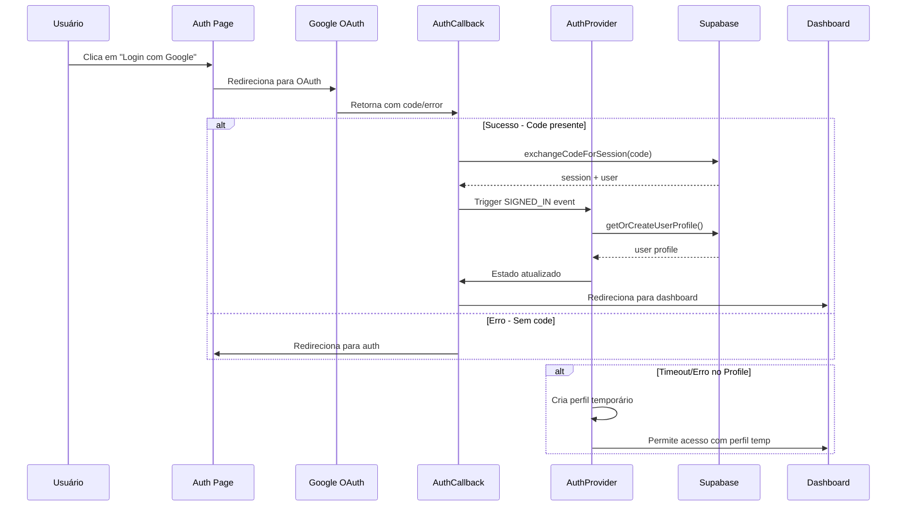
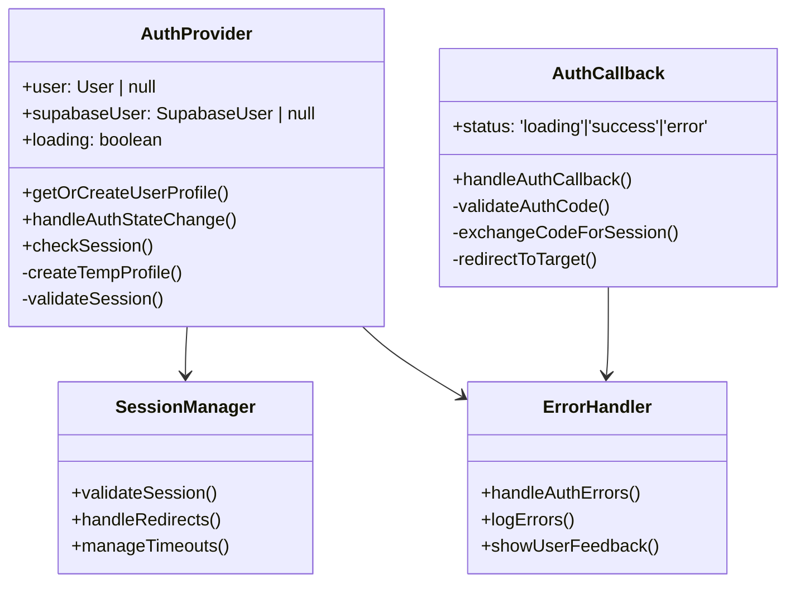

# Design: Correção de Problemas de Login e Autenticação

## Visão Geral

Este documento apresenta uma solução abrangente para os problemas críticos de autenticação identificados no StorySpark, incluindo falhas no fluxo de login, problemas de redirecionamento e travamento do AuthProvider durante o carregamento do perfil do usuário.

## Problemas Identificados

### 1. Problema Principal: Loop de Redirecionamento no AuthCallback
- **Sintoma**: "No authorization code found, redirecting to auth page"
- **Causa**: O componente AuthCallback está sendo acessado sem o código de autorização necessário
- **Impacto**: Impede completar o fluxo de login com sucesso

### 2. Problema de Timeout no AuthProvider
- **Sintoma**: AuthProvider trava indefinidamente na busca do perfil
- **Causa**: Queries do Supabase podem travar sem timeout adequado
- **Impacto**: Interface fica em loading permanente

### 3. Inconsistência de Estado entre SIGNED_IN e INITIAL_SESSION
- **Sintoma**: Eventos de autenticação conflitantes sendo disparados
- **Causa**: Gerenciamento inadequado do estado inicial de sessão
- **Impacto**: Estado de autenticação inconsistente

## Arquitetura da Solução

### Fluxo de Autenticação Melhorado



### Arquitetura de Componentes



## Componentes da Solução

### 1. AuthCallback Aprimorado

#### Validação de Parâmetros de URL
- Verificação rigorosa da presença do código de autorização
- Tratamento específico de diferentes tipos de erro do OAuth
- Logging detalhado para debugging

#### Gerenciamento de Estados
- Estados claros: `loading`, `success`, `error`, `invalid`
- Feedback visual apropriado para cada estado
- Timeouts configuráveis para operações

#### Redirecionamento Inteligente
- Preservação da URL de destino original
- Fallback para dashboard em caso de URL inválida
- Evitar loops de redirecionamento

### 2. AuthProvider Robusto

#### Sistema de Timeout e Fallback
- Timeout de 5 segundos para queries do Supabase
- Perfil temporário como fallback em caso de falha
- Retry automático com backoff exponencial

#### Gerenciamento de Estado Aprimorado
- Verificação de componente montado antes de updates
- Prevenção de condições de corrida
- Estado de loading mais granular

#### Tratamento de Erros Abrangente
- Categorização de erros por tipo
- Logging estruturado para debugging
- Recuperação automática quando possível

### 3. Sistema de Sessão Melhorado

#### Validação de Sessão
- Verificação da validade do token
- Refresh automático de tokens expirados
- Detecção de sessões órfãs

#### Persistência de Estado
- Storage local confiável
- Sincronização entre abas
- Limpeza automática de dados obsoletos

## Implementação Técnica

### 1. AuthCallback Aprimorado

```typescript
interface AuthCallbackState {
  status: 'loading' | 'success' | 'error' | 'invalid';
  error?: string;
  redirectTarget?: string;
}

const handleAuthCallback = async () => {
  // 1. Validar parâmetros obrigatórios
  const code = searchParams.get('code');
  const state = searchParams.get('state');
  const error = searchParams.get('error');
  
  // 2. Verificar se chegou por erro do OAuth
  if (error) {
    handleOAuthError(error, searchParams.get('error_description'));
    return;
  }
  
  // 3. Validar presença do código
  if (!code) {
    handleMissingCode();
    return;
  }
  
  // 4. Trocar código por sessão com timeout
  await exchangeCodeWithTimeout(code);
};
```

### 2. AuthProvider com Fallback

```typescript
const getOrCreateUserProfile = async (
  supabaseUser: SupabaseUser
): Promise<User | null> => {
  try {
    // 1. Teste de conectividade rápido
    await testSupabaseConnection();
    
    // 2. Query com timeout
    const profile = await queryUserProfileWithTimeout(supabaseUser.id);
    
    // 3. Criar perfil se não existir
    if (!profile) {
      return await createUserProfile(supabaseUser);
    }
    
    return profile;
  } catch (error) {
    // 4. Fallback para perfil temporário
    return createTempProfile(supabaseUser);
  }
};
```

### 3. Sistema de Monitoramento

```typescript
interface AuthMetrics {
  loginAttempts: number;
  successfulLogins: number;
  failedLogins: number;
  timeouts: number;
  fallbackUsage: number;
}

const trackAuthEvent = (event: string, data?: any) => {
  console.log(`🔍 AUTH_EVENT: ${event}`, data);
  // Enviar para sistema de analytics se configurado
};
```

## Estratégias de Recuperação

### 1. Recuperação de Falhas de Rede
- Retry automático com backoff exponential
- Fallback para perfil temporário após 3 tentativas
- Cache local de perfis para acesso offline

### 2. Recuperação de Estados Inconsistentes
- Reset do estado de autenticação
- Força nova verificação de sessão
- Limpeza de storage local corrompido

### 3. Recuperação de Loops de Redirecionamento
- Detecção de padrões de redirecionamento
- Quebra de loops após 3 tentativas
- Redirecionamento forçado para página segura

## Configurações e Constantes

### Timeouts
- **Query Timeout**: 5 segundos
- **OAuth Callback Timeout**: 10 segundos  
- **Session Check Timeout**: 3 segundos
- **Retry Delay**: 1s, 2s, 4s (backoff exponencial)

### URLs de Redirecionamento
- **Sucesso**: `/dashboard`
- **Erro**: `/auth`
- **Fallback**: `/`
- **OAuth Callback**: `/auth/callback`

### Configuração do Supabase Auth
```typescript
const authConfig = {
  redirectTo: `${window.location.origin}/auth/callback`,
  queryParams: {
    access_type: 'offline',
    prompt: 'consent',
  }
}
```

## Monitoramento e Debugging

### Logs Estruturados
- Timestamps precisos para cada evento
- IDs de usuário para rastreamento
- Stack traces completos para erros
- Métricas de performance

### Ferramentas de Debug
- Componente `AuthDebug` para inspeção em tempo real
- Logs de rede para comunicação com Supabase
- Estado de componentes em developer tools

### Alertas e Notificações
- Notificação de falhas repetidas
- Alertas de timeouts frequentes
- Monitoramento de taxa de sucesso de login

## Testing

### Testes de Unidade
- Validação de parâmetros do AuthCallback
- Lógica de fallback do AuthProvider
- Funções de utilitário de autenticação

### Testes de Integração
- Fluxo completo de OAuth
- Recuperação de falhas de rede
- Comportamento em cenários de timeout

### Testes de Edge Cases
- Tokens expirados
- Sessões inválidas
- Falhas de conectividade
- Dados corrompidos no storage

## Métricas de Sucesso

### KPIs Técnicos
- **Taxa de Sucesso de Login**: > 95%
- **Tempo Médio de Login**: < 3 segundos
- **Taxa de Fallback**: < 5%
- **Erros de Timeout**: < 2%

### KPIs de Usuário
- **Abandonos na Tela de Login**: < 10%
- **Tentativas de Login por Sessão**: < 2
- **Satisfação com Velocidade**: > 4.5/5
- **Tickets de Suporte por Login**: < 1%

## Conclusão

Esta solução fornece uma base sólida e resiliente para o sistema de autenticação do StorySpark, abordando os problemas críticos identificados através de:

1. **Validação rigorosa** no AuthCallback
2. **Sistema de fallback robusto** no AuthProvider  
3. **Monitoramento abrangente** para debugging
4. **Estratégias de recuperação** automática
5. **Timeouts configuráveis** para evitar travamentos

A implementação garante uma experiência de login confiável mesmo em cenários de falha, mantendo a funcionalidade através de perfis temporários e sistemas de retry inteligentes.