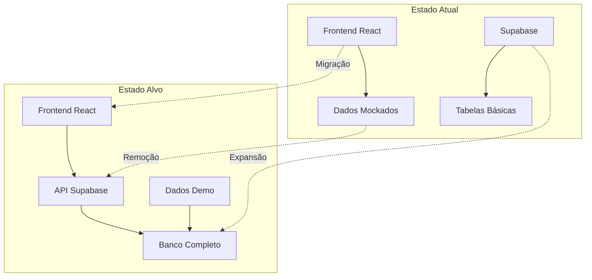

# Roadmap Completo: Integração Backend-Frontend StorySpark

## Overview

Este documento apresenta um roadmap completo para finalizar a integração backend-frontend da aplicação StorySpark, removendo dados mockados e estabelecendo conexões reais com o banco de dados Supabase. O objetivo é transformar a aplicação de protótipo com dados simulados em um sistema totalmente funcional e conectado.

## Arquitetura Atual vs. Alvo

### Estado Atual
- Frontend React com dados mockados hardcoded
- Supabase configurado com esquema básico (profiles, workspaces)
- Algumas páginas já integradas (Personas funcional)
- Sistema de autenticação ativo

### Estado Alvo
- Todas as entidades conectadas ao banco de dados
- Dados de demonstração populados via MCP
- CRUD completo para todas as funcionalidades
- Performance otimizada com cache e lazy loading



## Análise de Componentes com Dados Mockados

### 1. Brand Voices - Alta Prioridade
**Arquivo**: `src/pages/BrandVoices.tsx`
**Status**: Dados mockados hardcoded
**Complexidade**: Média

```typescript
// Dados mockados encontrados:
const brandVoices = [
  {
    id: 1,
    name: 'Tech Inovadora',
    description: 'Tom técnico e inovador',
    personality: ['Inovador', 'Técnico', 'Confiável'],
    tone: 'Profissional',
    style: 'Direto',
    audience: 'Desenvolvedores e CTOs',
    examples: [...],
    usageCount: 234,
    campaigns: 8,
    avgEngagement: 4.2,
    active: true
  }
  // ... mais 3 vozes mockadas
];
```

### 2. Campanhas - Alta Prioridade
**Arquivo**: `src/pages/Campaigns.tsx` e `CreateCampaignModal.tsx`
**Status**: Dados mockados com formulário funcional
**Complexidade**: Alta

```typescript
// Campanhas mockadas:
const campaigns = [
  {
    id: 1,
    name: 'Black Friday 2024',
    status: 'Ativa',
    platform: 'Instagram + Facebook',
    budget: 'R$ 5.000',
    spent: 2750,
    impressions: '45.2K',
    clicks: 1834,
    // ... mais campos
  }
];
```

### 3. Templates - Média Prioridade
**Arquivo**: `src/pages/admin/AdminTemplates.tsx`
**Status**: Sistema administrativo mockado
**Complexidade**: Média

### 4. Analytics e Dashboard - Média Prioridade
**Arquivos**: `src/pages/Dashboard.tsx`, `src/pages/Analytics.tsx`
**Status**: Estatísticas simuladas
**Complexidade**: Alta (gráficos e métricas)

### 5. Sistema Administrativo - Baixa Prioridade
**Arquivos**: `src/pages/admin/*`
**Status**: Dados mockados para demonstração
**Complexidade**: Baixa (pode ser implementado posteriormente)

## Esquema de Banco de Dados Necessário

### Tabelas Existentes
- `profiles` ✅
- `workspaces` ✅
- `workspace_members` ✅
- `target_personas` ✅

### Tabelas a Criar

#### 1. Brand Voices
```sql
CREATE TABLE brand_voices (
  id UUID PRIMARY KEY DEFAULT uuid_generate_v4(),
  workspace_id UUID REFERENCES workspaces(id) ON DELETE CASCADE,
  user_id UUID REFERENCES profiles(id) ON DELETE CASCADE,
  name VARCHAR(255) NOT NULL,
  description TEXT,
  personality JSONB DEFAULT '[]',
  tone VARCHAR(100),
  style VARCHAR(100),
  audience TEXT,
  examples JSONB DEFAULT '[]',
  guidelines TEXT,
  usage_count INTEGER DEFAULT 0,
  is_active BOOLEAN DEFAULT true,
  created_at TIMESTAMP WITH TIME ZONE DEFAULT NOW(),
  updated_at TIMESTAMP WITH TIME ZONE DEFAULT NOW()
);
```

#### 2. Campaigns
```sql
CREATE TABLE campaigns (
  id UUID PRIMARY KEY DEFAULT uuid_generate_v4(),
  workspace_id UUID REFERENCES workspaces(id) ON DELETE CASCADE,
  user_id UUID REFERENCES profiles(id) ON DELETE CASCADE,
  name VARCHAR(255) NOT NULL,
  description TEXT,
  status campaign_status DEFAULT 'draft',
  budget DECIMAL(10,2),
  start_date DATE,
  end_date DATE,
  platforms JSONB DEFAULT '[]',
  target_audience TEXT,
  persona_id UUID REFERENCES target_personas(id),
  brand_voice_id UUID REFERENCES brand_voices(id),
  objective VARCHAR(100),
  metadata JSONB DEFAULT '{}',
  tags JSONB DEFAULT '[]',
  created_at TIMESTAMP WITH TIME ZONE DEFAULT NOW(),
  updated_at TIMESTAMP WITH TIME ZONE DEFAULT NOW()
);

CREATE TYPE campaign_status AS ENUM ('draft', 'active', 'paused', 'completed', 'cancelled');
```

#### 3. Campaign Analytics
```sql
CREATE TABLE campaign_analytics (
  id UUID PRIMARY KEY DEFAULT uuid_generate_v4(),
  campaign_id UUID REFERENCES campaigns(id) ON DELETE CASCADE,
  date DATE NOT NULL,
  impressions INTEGER DEFAULT 0,
  clicks INTEGER DEFAULT 0,
  conversions INTEGER DEFAULT 0,
  spent DECIMAL(10,2) DEFAULT 0,
  reach INTEGER DEFAULT 0,
  engagement_rate DECIMAL(5,2) DEFAULT 0,
  ctr DECIMAL(5,2) DEFAULT 0,
  platform VARCHAR(50),
  created_at TIMESTAMP WITH TIME ZONE DEFAULT NOW()
);
```

#### 4. Content Templates
```sql
CREATE TABLE content_templates (
  id UUID PRIMARY KEY DEFAULT uuid_generate_v4(),
  workspace_id UUID REFERENCES workspaces(id) ON DELETE CASCADE,
  user_id UUID REFERENCES profiles(id) ON DELETE CASCADE,
  name VARCHAR(255) NOT NULL,
  description TEXT,
  category VARCHAR(100),
  platform VARCHAR(50),
  content_type VARCHAR(50),
  template_content TEXT NOT NULL,
  variables JSONB DEFAULT '[]',
  tags JSONB DEFAULT '[]',
  usage_count INTEGER DEFAULT 0,
  likes_count INTEGER DEFAULT 0,
  performance_score DECIMAL(5,2) DEFAULT 0,
  is_active BOOLEAN DEFAULT true,
  is_global BOOLEAN DEFAULT false,
  created_at TIMESTAMP WITH TIME ZONE DEFAULT NOW(),
  updated_at TIMESTAMP WITH TIME ZONE DEFAULT NOW()
);
```

#### 5. Generated Copies
```sql
CREATE TABLE generated_copies (
  id UUID PRIMARY KEY DEFAULT uuid_generate_v4(),
  workspace_id UUID REFERENCES workspaces(id) ON DELETE CASCADE,
  user_id UUID REFERENCES profiles(id) ON DELETE CASCADE,
  campaign_id UUID REFERENCES campaigns(id),
  brand_voice_id UUID REFERENCES brand_voices(id),
  persona_id UUID REFERENCES target_personas(id),
  template_id UUID REFERENCES content_templates(id),
  channel VARCHAR(50) NOT NULL,
  content TEXT NOT NULL,
  brief JSONB NOT NULL,
  ai_provider VARCHAR(50) NOT NULL DEFAULT 'openai',
  ai_model VARCHAR(50) NOT NULL DEFAULT 'gpt-4',
  word_count INTEGER DEFAULT 0,
  credits_used INTEGER DEFAULT 1,
  is_favorite BOOLEAN DEFAULT false,
  performance_data JSONB DEFAULT '{}',
  status VARCHAR(20) DEFAULT 'generated',
  created_at TIMESTAMP WITH TIME ZONE DEFAULT NOW(),
  updated_at TIMESTAMP WITH TIME ZONE DEFAULT NOW()
);
```

## Fases de Implementação

### Fase 1: Estrutura Base (Semana 1)
**Objetivo**: Criar tabelas essenciais e migrar Brand Voices

#### Tasks:
1. **Criar esquema de banco de dados**
   - Executar migrações SQL para todas as tabelas
   - Configurar índices e constraints
   - Implementar RLS (Row Level Security)

2. **Migrar Brand Voices**
   - Remover dados mockados de `BrandVoices.tsx`
   - Implementar CRUD com Supabase
   - Criar hook `useBrandVoices`
   - Testar criação, edição e exclusão

3. **Popular dados de demonstração**
   - Criar script para popular brand_voices via MCP
   - Inserir 4-5 vozes de marca variadas
   - Testar integração completa

#### Entregáveis:
- Tabelas criadas no Supabase
- Brand Voices totalmente funcional
- Dados de demo populados

### Fase 2: Campanhas e Analytics (Semana 2)
**Objetivo**: Sistema completo de campanhas

#### Tasks:
1. **Implementar CRUD de Campanhas**
   - Migrar `Campaigns.tsx` para Supabase
   - Atualizar `CreateCampaignModal.tsx`
   - Implementar filtros e busca
   - Conectar com Brand Voices e Personas

2. **Sistema de Analytics Básico**
   - Implementar `campaign_analytics`
   - Criar gráficos básicos no Dashboard
   - Métricas de performance por campanha
   - Integração com dados reais

3. **Dashboard Real**
   - Remover stats mockados
   - Implementar `useStats` com dados reais
   - Atividades recentes do banco
   - Cards dinâmicos baseados em dados

#### Entregáveis:
- Campanhas totalmente funcionais
- Dashboard com dados reais
- Analytics básicos implementados

### Fase 3: Templates e Conteúdo (Semana 3)
**Objetivo**: Sistema de templates e geração de conteúdo

#### Tasks:
1. **Sistema de Templates**
   - Migrar `AdminTemplates.tsx`
   - Implementar categorização
   - Sistema de variáveis dinâmicas
   - Templates globais vs. workspace

2. **Geração de Copies**
   - Implementar `generated_copies`
   - Integrar com IA real (OpenAI/Claude)
   - Histórico de gerações
   - Sistema de favoritos

3. **Content Library**
   - Biblioteca de conteúdo gerado
   - Filtros avançados
   - Reutilização de copies
   - Performance tracking

#### Entregáveis:
- Sistema de templates funcional
- Geração de conteúdo real
- Biblioteca de conteúdo

### Fase 4: Otimização e Features Avançadas (Semana 4)
**Objetivo**: Polimento e recursos avançados

#### Tasks:
1. **Otimização de Performance**
   - Implementar cache com React Query
   - Lazy loading de componentes
   - Otimização de queries
   - Compressão de imagens

2. **Features Administrativas**
   - Migrar painéis admin restantes
   - Sistema de logs real
   - Monitoramento de uso
   - Relatórios avançados

3. **Integração de Dados Demo**
   - Script completo de seed data
   - Personas variadas
   - Campanhas de exemplo
   - Templates populares

#### Entregáveis:
- Performance otimizada
- Sistema administrativo completo
- Dados de demonstração ricos

## Hooks e Services Necessários

### Custom Hooks
```typescript
// Hook para Brand Voices
export const useBrandVoices = () => {
  const { data, loading, error } = useQuery(['brand-voices'], fetchBrandVoices);
  const createMutation = useMutation(createBrandVoice);
  const updateMutation = useMutation(updateBrandVoice);
  const deleteMutation = useMutation(deleteBrandVoice);
  
  return {
    voices: data || [],
    loading,
    error,
    createVoice: createMutation.mutate,
    updateVoice: updateMutation.mutate,
    deleteVoice: deleteMutation.mutate
  };
};

// Hook para Campanhas
export const useCampaigns = () => {
  // Similar implementation
};

// Hook para Analytics
export const useAnalytics = (campaignId?: string) => {
  // Analytics data with real-time updates
};
```

### Services Layer
```typescript
// services/brandVoices.ts
export const brandVoicesService = {
  async getAll(workspaceId: string) {
    const { data, error } = await supabase
      .from('brand_voices')
      .select('*')
      .eq('workspace_id', workspaceId)
      .eq('is_active', true)
      .order('created_at', { ascending: false });
    
    if (error) throw error;
    return data;
  },
  
  async create(voice: CreateBrandVoiceInput) {
    // Implementation
  },
  
  async update(id: string, updates: UpdateBrandVoiceInput) {
    // Implementation  
  },
  
  async delete(id: string) {
    // Soft delete implementation
  }
};
```

## Dados de Demonstração

### Scripts de Seed Data via MCP

#### Brand Voices
```json
[
  {
    "name": "Tech Inovadora",
    "description": "Tom técnico e inovador para produtos de tecnologia",
    "personality": ["Inovador", "Técnico", "Confiável"],
    "tone": "Profissional",
    "style": "Direto",
    "audience": "Desenvolvedores e CTOs",
    "examples": [
      "Revolucione seu código com nossa nova API REST ultra-rápida.",
      "Eficiência redefinida: deploy em segundos, performance em milissegundos.",
      "Para desenvolvedores que não aceitam compromissos com a qualidade."
    ]
  },
  {
    "name": "Casual Jovem",
    "description": "Linguagem descontraída para público jovem",
    "personality": ["Descontraído", "Autêntico", "Energético"],
    "tone": "Casual",
    "style": "Conversacional",
    "audience": "Jovens 18-35 anos",
    "examples": [
      "Bora transformar sua feed? 🚀",
      "Aquele upgrade que sua vida tava precisando chegou!",
      "Sem mimimi: qualidade que você pode confiar 💯"
    ]
  }
]
```

#### Personas
```json
[
  {
    "name": "Ana Silva - CMO Tech",
    "occupation": "Chief Marketing Officer",
    "age_range": "35-45",
    "location": "São Paulo, SP",
    "pain_points": ["Falta de tempo para criar conteúdo", "Dificuldade de mensurar ROI", "Pressão por resultados"],
    "goals": ["Aumentar brand awareness", "Gerar leads qualificados", "Otimizar conversões"],
    "interests": ["Marketing digital", "Inovação", "Liderança"],
    "preferred_channels": ["LinkedIn", "Email", "Webinars"]
  }
]
```

#### Campanhas de Exemplo
```json
[
  {
    "name": "Black Friday Tech 2024",
    "description": "Campanha para promoção de produtos tecnológicos",
    "status": "active",
    "budget": 5000.00,
    "start_date": "2024-11-15",
    "end_date": "2024-11-30",
    "platforms": ["instagram", "facebook", "linkedin"],
    "objective": "Sales (Vendas)",
    "target_audience": "Profissionais de tecnologia interessados em ferramentas inovadoras"
  }
]
```

## Considerações Técnicas

### Performance
- Implementar pagination para listas grandes
- Cache inteligente com React Query
- Lazy loading de componentes pesados
- Otimização de imagens e assets

### Segurança
- Row Level Security (RLS) em todas as tabelas
- Validação de permissões por workspace
- Sanitização de inputs do usuário
- Rate limiting para operações críticas

### Escalabilidade
- Índices otimizados para queries frequentes
- Separação de dados por workspace
- Backup automático de dados críticos
- Monitoramento de performance

### UX/UI
- Loading states consistentes
- Error handling robusto
- Feedback visual para ações
- Estados vazios informativos

## Testes

### Testes de Integração
- CRUD completo para cada entidade
- Relacionamentos entre tabelas
- Permissões e segurança
- Performance com grandes volumes

### Testes de UX
- Fluxo completo de criação de campanha
- Geração de conteúdo end-to-end
- Navegação entre funcionalidades
- Responsividade em dispositivos móveis

## Cronograma de Execução

| Semana | Foco    | Tasks Principais      | Entregáveis                             |
| ------ | ------- | --------------------- | --------------------------------------- |
| 1      | Base    | Schema + Brand Voices | Tabelas criadas, Brand Voices funcional |
| 2      | Core    | Campanhas + Analytics | Campanhas completas, Dashboard real     |
| 3      | Content | Templates + Geração   | Sistema de templates, IA integrada      |
| 4      | Polish  | Otimização + Admin    | Performance, dados demo completos       |

## Métricas de Sucesso

### Técnicas
- 0% de dados mockados restantes
- Tempo de resposta < 500ms para queries principais
- 100% de cobertura CRUD para entidades principais
- 0 erros críticos em produção

### Funcionais
- Usuário consegue criar campanha completa em < 3 minutos
- Geração de conteúdo funcional com IA real
- Dashboard atualizado em tempo real
- Sistema utilizável por usuário não-técnico

## Riscos e Mitigações

### Riscos Técnicos
- **Complexidade das migrações**: Testar em ambiente staging primeiro
- **Performance do banco**: Monitorar queries e otimizar índices
- **Integração IA**: Ter fallbacks e tratamento de erros robusto

### Riscos de Produto
- **UX durante migração**: Implementar feature flags para rollback
- **Perda de dados**: Backup antes de cada migração
- **Inconsistência de dados**: Validação rigorosa nas interfaces- Algumas páginas já integradas (Personas funcional)
- Sistema de autenticação ativo

### Estado Alvo
- Todas as entidades conectadas ao banco de dados
- Dados de demonstração populados via MCP
- CRUD completo para todas as funcionalidades
- Performance otimizada com cache e lazy loading


## Análise de Componentes com Dados Mockados

### 1. Brand Voices - Alta Prioridade
**Arquivo**: `src/pages/BrandVoices.tsx`
**Status**: Dados mockados hardcoded
**Complexidade**: Média

```typescript
// Dados mockados encontrados:
const brandVoices = [
  {
    id: 1,
    name: 'Tech Inovadora',
    description: 'Tom técnico e inovador',
    personality: ['Inovador', 'Técnico', 'Confiável'],
    tone: 'Profissional',
    style: 'Direto',
    audience: 'Desenvolvedores e CTOs',
    examples: [...],
    usageCount: 234,
    campaigns: 8,
    avgEngagement: 4.2,
    active: true
  }
  // ... mais 3 vozes mockadas
];
```

### 2. Campanhas - Alta Prioridade
**Arquivo**: `src/pages/Campaigns.tsx` e `CreateCampaignModal.tsx`
**Status**: Dados mockados com formulário funcional
**Complexidade**: Alta

```typescript
// Campanhas mockadas:
const campaigns = [
  {
    id: 1,
    name: 'Black Friday 2024',
    status: 'Ativa',
    platform: 'Instagram + Facebook',
    budget: 'R$ 5.000',
    spent: 2750,
    impressions: '45.2K',
    clicks: 1834,
    // ... mais campos
  }
];
```

### 3. Templates - Média Prioridade
**Arquivo**: `src/pages/admin/AdminTemplates.tsx`
**Status**: Sistema administrativo mockado
**Complexidade**: Média

### 4. Analytics e Dashboard - Média Prioridade
**Arquivos**: `src/pages/Dashboard.tsx`, `src/pages/Analytics.tsx`
**Status**: Estatísticas simuladas
**Complexidade**: Alta (gráficos e métricas)

### 5. Sistema Administrativo - Baixa Prioridade
**Arquivos**: `src/pages/admin/*`
**Status**: Dados mockados para demonstração
**Complexidade**: Baixa (pode ser implementado posteriormente)

## Esquema de Banco de Dados Necessário

### Tabelas Existentes
- `profiles` ✅
- `workspaces` ✅
- `workspace_members` ✅
- `target_personas` ✅

### Tabelas a Criar

#### 1. Brand Voices
```sql
CREATE TABLE brand_voices (
  id UUID PRIMARY KEY DEFAULT uuid_generate_v4(),
  workspace_id UUID REFERENCES workspaces(id) ON DELETE CASCADE,
  user_id UUID REFERENCES profiles(id) ON DELETE CASCADE,
  name VARCHAR(255) NOT NULL,
  description TEXT,
  personality JSONB DEFAULT '[]',
  tone VARCHAR(100),
  style VARCHAR(100),
  audience TEXT,
  examples JSONB DEFAULT '[]',
  guidelines TEXT,
  usage_count INTEGER DEFAULT 0,
  is_active BOOLEAN DEFAULT true,
  created_at TIMESTAMP WITH TIME ZONE DEFAULT NOW(),
  updated_at TIMESTAMP WITH TIME ZONE DEFAULT NOW()
);
```

#### 2. Campaigns
```sql
CREATE TABLE campaigns (
  id UUID PRIMARY KEY DEFAULT uuid_generate_v4(),
  workspace_id UUID REFERENCES workspaces(id) ON DELETE CASCADE,
  user_id UUID REFERENCES profiles(id) ON DELETE CASCADE,
  name VARCHAR(255) NOT NULL,
  description TEXT,
  status campaign_status DEFAULT 'draft',
  budget DECIMAL(10,2),
  start_date DATE,
  end_date DATE,
  platforms JSONB DEFAULT '[]',
  target_audience TEXT,
  persona_id UUID REFERENCES target_personas(id),
  brand_voice_id UUID REFERENCES brand_voices(id),
  objective VARCHAR(100),
  metadata JSONB DEFAULT '{}',
  tags JSONB DEFAULT '[]',
  created_at TIMESTAMP WITH TIME ZONE DEFAULT NOW(),
  updated_at TIMESTAMP WITH TIME ZONE DEFAULT NOW()
);

CREATE TYPE campaign_status AS ENUM ('draft', 'active', 'paused', 'completed', 'cancelled');
```

#### 3. Campaign Analytics
```sql
CREATE TABLE campaign_analytics (
  id UUID PRIMARY KEY DEFAULT uuid_generate_v4(),
  campaign_id UUID REFERENCES campaigns(id) ON DELETE CASCADE,
  date DATE NOT NULL,
  impressions INTEGER DEFAULT 0,
  clicks INTEGER DEFAULT 0,
  conversions INTEGER DEFAULT 0,
  spent DECIMAL(10,2) DEFAULT 0,
  reach INTEGER DEFAULT 0,
  engagement_rate DECIMAL(5,2) DEFAULT 0,
  ctr DECIMAL(5,2) DEFAULT 0,
  platform VARCHAR(50),
  created_at TIMESTAMP WITH TIME ZONE DEFAULT NOW()
);
```

#### 4. Content Templates
```sql
CREATE TABLE content_templates (
  id UUID PRIMARY KEY DEFAULT uuid_generate_v4(),
  workspace_id UUID REFERENCES workspaces(id) ON DELETE CASCADE,
  user_id UUID REFERENCES profiles(id) ON DELETE CASCADE,
  name VARCHAR(255) NOT NULL,
  description TEXT,
  category VARCHAR(100),
  platform VARCHAR(50),
  content_type VARCHAR(50),
  template_content TEXT NOT NULL,
  variables JSONB DEFAULT '[]',
  tags JSONB DEFAULT '[]',
  usage_count INTEGER DEFAULT 0,
  likes_count INTEGER DEFAULT 0,
  performance_score DECIMAL(5,2) DEFAULT 0,
  is_active BOOLEAN DEFAULT true,
  is_global BOOLEAN DEFAULT false,
  created_at TIMESTAMP WITH TIME ZONE DEFAULT NOW(),
  updated_at TIMESTAMP WITH TIME ZONE DEFAULT NOW()
);
```

#### 5. Generated Copies
```sql
CREATE TABLE generated_copies (
  id UUID PRIMARY KEY DEFAULT uuid_generate_v4(),
  workspace_id UUID REFERENCES workspaces(id) ON DELETE CASCADE,
  user_id UUID REFERENCES profiles(id) ON DELETE CASCADE,
  campaign_id UUID REFERENCES campaigns(id),
  brand_voice_id UUID REFERENCES brand_voices(id),
  persona_id UUID REFERENCES target_personas(id),
  template_id UUID REFERENCES content_templates(id),
  channel VARCHAR(50) NOT NULL,
  content TEXT NOT NULL,
  brief JSONB NOT NULL,
  ai_provider VARCHAR(50) NOT NULL DEFAULT 'openai',
  ai_model VARCHAR(50) NOT NULL DEFAULT 'gpt-4',
  word_count INTEGER DEFAULT 0,
  credits_used INTEGER DEFAULT 1,
  is_favorite BOOLEAN DEFAULT false,
  performance_data JSONB DEFAULT '{}',
  status VARCHAR(20) DEFAULT 'generated',
  created_at TIMESTAMP WITH TIME ZONE DEFAULT NOW(),
  updated_at TIMESTAMP WITH TIME ZONE DEFAULT NOW()
);
```

## Fases de Implementação

### Fase 1: Estrutura Base (Semana 1)
**Objetivo**: Criar tabelas essenciais e migrar Brand Voices

#### Tasks:
1. **Criar esquema de banco de dados**
   - Executar migrações SQL para todas as tabelas
   - Configurar índices e constraints
   - Implementar RLS (Row Level Security)

2. **Migrar Brand Voices**
   - Remover dados mockados de `BrandVoices.tsx`
   - Implementar CRUD com Supabase
   - Criar hook `useBrandVoices`
   - Testar criação, edição e exclusão

3. **Popular dados de demonstração**
   - Criar script para popular brand_voices via MCP
   - Inserir 4-5 vozes de marca variadas
   - Testar integração completa

#### Entregáveis:
- Tabelas criadas no Supabase
- Brand Voices totalmente funcional
- Dados de demo populados

### Fase 2: Campanhas e Analytics (Semana 2)
**Objetivo**: Sistema completo de campanhas

#### Tasks:
1. **Implementar CRUD de Campanhas**
   - Migrar `Campaigns.tsx` para Supabase
   - Atualizar `CreateCampaignModal.tsx`
   - Implementar filtros e busca
   - Conectar com Brand Voices e Personas

2. **Sistema de Analytics Básico**
   - Implementar `campaign_analytics`
   - Criar gráficos básicos no Dashboard
   - Métricas de performance por campanha
   - Integração com dados reais

3. **Dashboard Real**
   - Remover stats mockados
   - Implementar `useStats` com dados reais
   - Atividades recentes do banco
   - Cards dinâmicos baseados em dados

#### Entregáveis:
- Campanhas totalmente funcionais
- Dashboard com dados reais
- Analytics básicos implementados

### Fase 3: Templates e Conteúdo (Semana 3)
**Objetivo**: Sistema de templates e geração de conteúdo

#### Tasks:
1. **Sistema de Templates**
   - Migrar `AdminTemplates.tsx`
   - Implementar categorização
   - Sistema de variáveis dinâmicas
   - Templates globais vs. workspace

2. **Geração de Copies**
   - Implementar `generated_copies`
   - Integrar com IA real (OpenAI/Claude)
   - Histórico de gerações
   - Sistema de favoritos

3. **Content Library**
   - Biblioteca de conteúdo gerado
   - Filtros avançados
   - Reutilização de copies
   - Performance tracking

#### Entregáveis:
- Sistema de templates funcional
- Geração de conteúdo real
- Biblioteca de conteúdo

### Fase 4: Otimização e Features Avançadas (Semana 4)
**Objetivo**: Polimento e recursos avançados

#### Tasks:
1. **Otimização de Performance**
   - Implementar cache com React Query
   - Lazy loading de componentes
   - Otimização de queries
   - Compressão de imagens

2. **Features Administrativas**
   - Migrar painéis admin restantes
   - Sistema de logs real
   - Monitoramento de uso
   - Relatórios avançados

3. **Integração de Dados Demo**
   - Script completo de seed data
   - Personas variadas
   - Campanhas de exemplo
   - Templates populares

#### Entregáveis:
- Performance otimizada
- Sistema administrativo completo
- Dados de demonstração ricos

## Hooks e Services Necessários

### Custom Hooks
```typescript
// Hook para Brand Voices
export const useBrandVoices = () => {
  const { data, loading, error } = useQuery(['brand-voices'], fetchBrandVoices);
  const createMutation = useMutation(createBrandVoice);
  const updateMutation = useMutation(updateBrandVoice);
  const deleteMutation = useMutation(deleteBrandVoice);
  
  return {
    voices: data || [],
    loading,
    error,
    createVoice: createMutation.mutate,
    updateVoice: updateMutation.mutate,
    deleteVoice: deleteMutation.mutate
  };
};

// Hook para Campanhas
export const useCampaigns = () => {
  // Similar implementation
};

// Hook para Analytics
export const useAnalytics = (campaignId?: string) => {
  // Analytics data with real-time updates
};
```

### Services Layer
```typescript
// services/brandVoices.ts
export const brandVoicesService = {
  async getAll(workspaceId: string) {
    const { data, error } = await supabase
      .from('brand_voices')
      .select('*')
      .eq('workspace_id', workspaceId)
      .eq('is_active', true)
      .order('created_at', { ascending: false });
    
    if (error) throw error;
    return data;
  },
  
  async create(voice: CreateBrandVoiceInput) {
    // Implementation
  },
  
  async update(id: string, updates: UpdateBrandVoiceInput) {
    // Implementation  
  },
  
  async delete(id: string) {
    // Soft delete implementation
  }
};
```

## Dados de Demonstração

### Scripts de Seed Data via MCP

#### Brand Voices
```json
[
  {
    "name": "Tech Inovadora",
    "description": "Tom técnico e inovador para produtos de tecnologia",
    "personality": ["Inovador", "Técnico", "Confiável"],
    "tone": "Profissional",
    "style": "Direto",
    "audience": "Desenvolvedores e CTOs",
    "examples": [
      "Revolucione seu código com nossa nova API REST ultra-rápida.",
      "Eficiência redefinida: deploy em segundos, performance em milissegundos.",
      "Para desenvolvedores que não aceitam compromissos com a qualidade."
    ]
  },
  {
    "name": "Casual Jovem",
    "description": "Linguagem descontraída para público jovem",
    "personality": ["Descontraído", "Autêntico", "Energético"],
    "tone": "Casual",
    "style": "Conversacional",
    "audience": "Jovens 18-35 anos",
    "examples": [
      "Bora transformar sua feed? 🚀",
      "Aquele upgrade que sua vida tava precisando chegou!",
      "Sem mimimi: qualidade que você pode confiar 💯"
    ]
  }
]
```

#### Personas
```json
[
  {
    "name": "Ana Silva - CMO Tech",
    "occupation": "Chief Marketing Officer",
    "age_range": "35-45",
    "location": "São Paulo, SP",
    "pain_points": ["Falta de tempo para criar conteúdo", "Dificuldade de mensurar ROI", "Pressão por resultados"],
    "goals": ["Aumentar brand awareness", "Gerar leads qualificados", "Otimizar conversões"],
    "interests": ["Marketing digital", "Inovação", "Liderança"],
    "preferred_channels": ["LinkedIn", "Email", "Webinars"]
  }
]
```

#### Campanhas de Exemplo
```json
[
  {
    "name": "Black Friday Tech 2024",
    "description": "Campanha para promoção de produtos tecnológicos",
    "status": "active",
    "budget": 5000.00,
    "start_date": "2024-11-15",
    "end_date": "2024-11-30",
    "platforms": ["instagram", "facebook", "linkedin"],
    "objective": "Sales (Vendas)",
    "target_audience": "Profissionais de tecnologia interessados em ferramentas inovadoras"
  }
]
```

## Considerações Técnicas

### Performance
- Implementar pagination para listas grandes
- Cache inteligente com React Query
- Lazy loading de componentes pesados
- Otimização de imagens e assets

### Segurança
- Row Level Security (RLS) em todas as tabelas
- Validação de permissões por workspace
- Sanitização de inputs do usuário
- Rate limiting para operações críticas

### Escalabilidade
- Índices otimizados para queries frequentes
- Separação de dados por workspace
- Backup automático de dados críticos
- Monitoramento de performance

### UX/UI
- Loading states consistentes
- Error handling robusto
- Feedback visual para ações
- Estados vazios informativos

## Testes

### Testes de Integração
- CRUD completo para cada entidade
- Relacionamentos entre tabelas
- Permissões e segurança
- Performance com grandes volumes

### Testes de UX
- Fluxo completo de criação de campanha
- Geração de conteúdo end-to-end
- Navegação entre funcionalidades
- Responsividade em dispositivos móveis

## Cronograma de Execução

| Semana | Foco    | Tasks Principais      | Entregáveis                             |
| ------ | ------- | --------------------- | --------------------------------------- |
| 1      | Base    | Schema + Brand Voices | Tabelas criadas, Brand Voices funcional |
| 2      | Core    | Campanhas + Analytics | Campanhas completas, Dashboard real     |
| 3      | Content | Templates + Geração   | Sistema de templates, IA integrada      |
| 4      | Polish  | Otimização + Admin    | Performance, dados demo completos       |

## Métricas de Sucesso

### Técnicas
- 0% de dados mockados restantes
- Tempo de resposta < 500ms para queries principais
- 100% de cobertura CRUD para entidades principais
- 0 erros críticos em produção

### Funcionais
- Usuário consegue criar campanha completa em < 3 minutos
- Geração de conteúdo funcional com IA real
- Dashboard atualizado em tempo real
- Sistema utilizável por usuário não-técnico

## Riscos e Mitigações

### Riscos Técnicos
- **Complexidade das migrações**: Testar em ambiente staging primeiro
- **Performance do banco**: Monitorar queries e otimizar índices
- **Integração IA**: Ter fallbacks e tratamento de erros robusto

### Riscos de Produto
- **UX durante migração**: Implementar feature flags para rollback
- **Perda de dados**: Backup antes de cada migração
- **Inconsistência de dados**: Validação rigorosa nas interfaces


